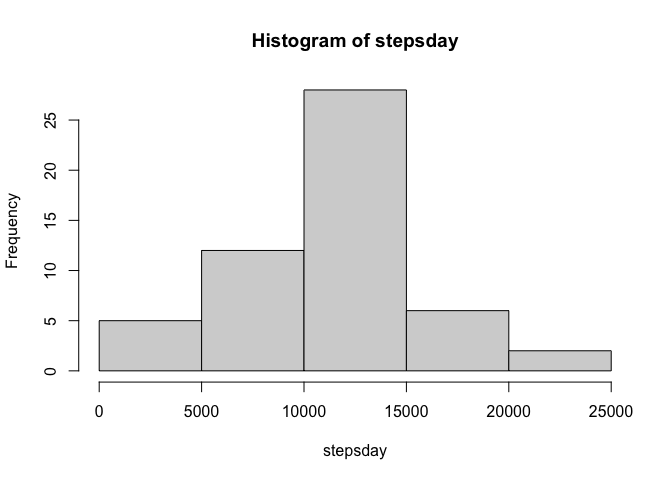
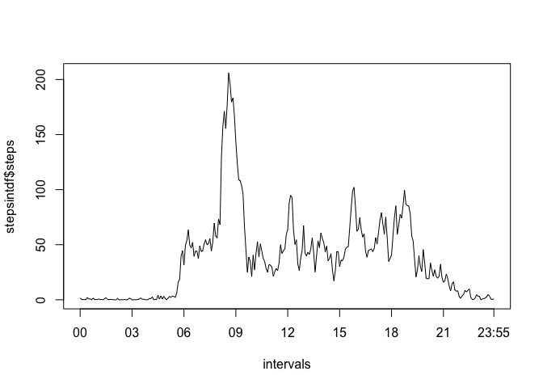
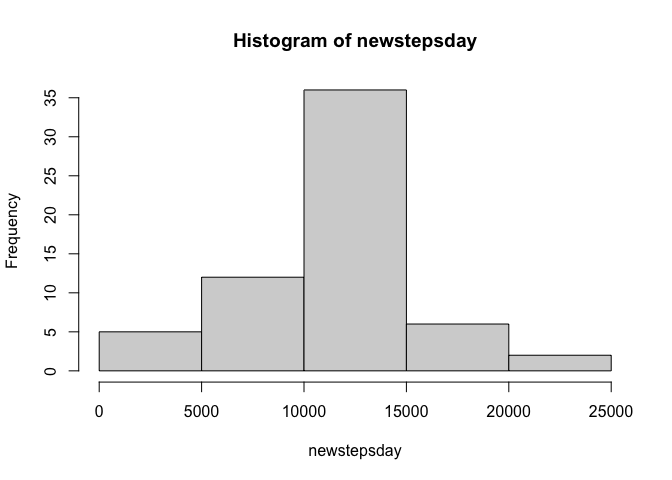
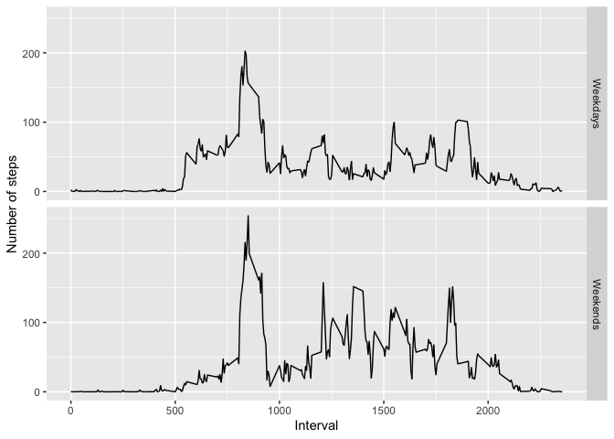

## Loading and preprocessing the data


```r
dataCA <- read.csv("activity.csv")
```


## What is mean total number of steps taken per day?

As it can be seen in the histogram, and the mean and median values, the data show that the number of daily steps are, on average, a bit over 10 thousand. 


```r
stepsday <- tapply(dataCA$steps,dataCA$date, FUN =sum)
hist(stepsday)
```

<!-- -->

```r
mean(stepsday, na.rm=TRUE)
```

```
## [1] 10766.19
```

```r
median(stepsday, na.rm=TRUE)
```

```
## [1] 10765
```


## What is the average daily activity pattern?

We can see a clear rise in activity in the morning, which peaks around half past eight, and gets lower afterwards. There is also a clear resting pattern at night.


```r
library(dplyr)
```

```
## 
## Attaching package: 'dplyr'
```

```
## The following objects are masked from 'package:stats':
## 
##     filter, lag
```

```
## The following objects are masked from 'package:base':
## 
##     intersect, setdiff, setequal, union
```

```r
nonaint <- complete.cases(dataCA$steps)
stepsint <- tapply(dataCA$steps[nonaint],dataCA$interval[nonaint], FUN =mean)
stepsintdf <- tibble(interval = names(stepsint), steps = as.numeric(stepsint))
maxint <- stepsintdf$steps == max(stepsintdf$steps)
stepsintdf$interval[maxint]
```

```
## [1] "835"
```

```r
stepsintdf$steps[maxint]
```

```
## [1] 206.1698
```

```r
library(stringr)
library(lubridate)
```

```
## 
## Attaching package: 'lubridate'
```

```
## The following objects are masked from 'package:base':
## 
##     date, intersect, setdiff, union
```

```r
times <- stepsintdf$interval
mins  <-  substr(times, nchar(times)-1, nchar(times))
hour  <-  substr(times, 0, nchar(times)-2)
hour[1:12] <- rep("0",12)
intervals <- hours(hour) + minutes(mins)
plot(intervals, stepsintdf$steps, type = "l",xaxt="n")
axis(1, at=c(0,10800, 21600, 32400, 43200, 54000, 64800, 75600, 86100),labels=c("00", "03", "06", "09", "12", "15", "18", "21", "23:55"))
```

<!-- -->

## Imputing missing values

We imputed the interval mean for the missing values, which made the median (whicha as already very close) equal to the mean.

The histogram shows a clear difference in the frequency of days with a number of steps between 10,000 and 15,000.


```r
names(stepsintdf) <- c("interval", "stepsmean")
dataCA1 <- merge(dataCA, stepsintdf)
# stepsdayx <- tapply(dataCA$steps,dataCA$date, FUN =sum, na.rm = TRUE)
# stepsdaydf <- tibble(date = names(stepsdayx), stepsx = as.numeric(stepsdayx))
# stepsdaydf$date <- ymd(stepsdaydf$date)
dataCA1$date <- ymd(dataCA1$date)
#head(dataCA1)
#head(stepsdaydf)
#dataCA2 <- merge(dataCA1, stepsdaydf)
dataCA1$steps[is.na(dataCA1$steps)] <- dataCA1$stepsmean[is.na(dataCA1$steps)]
newstepsday <- tapply(dataCA1$steps,dataCA1$date, FUN =sum)
hist(newstepsday)
```

<!-- -->

```r
mean(newstepsday)
```

```
## [1] 10766.19
```

```r
median(newstepsday)
```

```
## [1] 10766.19
```

## Are there differences in activity patterns between weekdays and weekends?

The weekends appear to be more active along the day, with the exception of the early hours, which makes sense after all.


```r
dataCA2 <- mutate(dataCA1, week = wday(dataCA1$date) <=5)
dataCA2$week <- factor(x = as.character(dataCA2$week), levels = c("TRUE", "FALSE"), labels = c("Weekdays", "Weekends"))
dataweek <-filter(dataCA2, week == "Weekdays")
datawknd <-filter(dataCA2, week == "Weekends")
stepsintweek <- tapply(dataweek$steps,dataweek$interval, FUN =mean)
stepsintwknd <- tapply(datawknd$steps,datawknd$interval, FUN =mean)
stepsintweekdf <- tibble(interval = names(stepsintweek), stepsmean2 = as.numeric(stepsintweek))
stepsintwknddf <- tibble(interval = names(stepsintwknd), stepsmean2 = as.numeric(stepsintwknd))
dataweek2 <- merge(dataweek, stepsintweekdf)
datawknd2 <- merge(datawknd, stepsintwknddf)
datawhole <- rbind(dataweek2,datawknd2)
library(ggplot2)
g <- ggplot(datawhole, aes(interval, stepsmean2)) 
g + geom_line() + labs(x = "Interval", y = "Number of steps") + facet_grid(week ~ .)
```

<!-- -->
